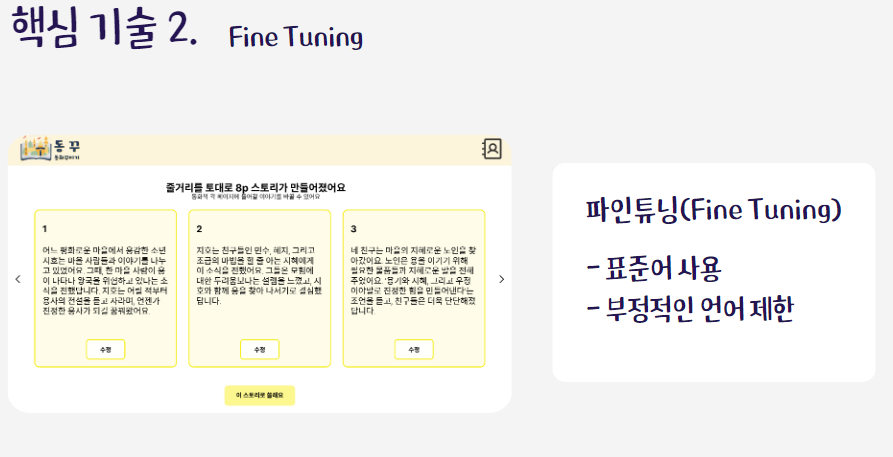
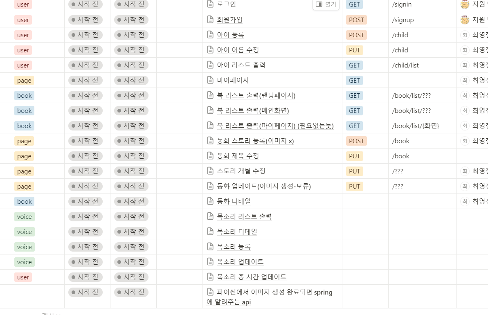
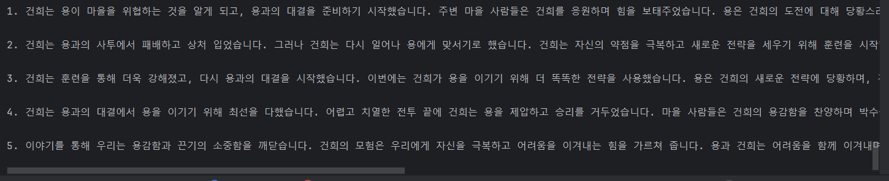

## 2024-04-18 목요일

- 기능 명세서를 바탕으로 ERD 작성

- PPT 발표 자료 배경 조사 및 기술 소개 부분 작성  

## 2024-04-19 금요일 

- 주요 기술 및 기대효과 페이지 PPT 작성 
ex) 예시사진

- 필드트립에서 ai 관련 체험을 통해 지식 습득

## 2024-04-22 월요일

- api 명세서 작성
ex) 예시사진

## 2024-04-23 화요일

- api 명세서 마무리(공통)
    1) 스토리 관련 api 명세서 작성 및 수정

- gerrit 초기 설정
    1) gerrit admin 계정 비밀번호 설정
    2) EC2의 gerrit repository 생성 및 gitlab과 연동
    3) 로컬 개발 환경 설정 맞추기
    4) notion에 gerrit 관련 자료 정리!

## 2024-04-24 수요일

- 팀내 gerrit 사용법 확정(노션에 정리)

- openAi 탐색 후 config 파일 생성
- openAi 코드 적용
- story 작성 코드 적용

## 2024-04-25 목요일

- openAi와 Spring Boot 연동
- openAi 이용해서 prompt를 story로 변환
- story 8컷으로 나누고 동화 및 페이지 객체 생성
  

## 2024-04-26 금요일

- 401 에러 해결(OpenAi api key 관련 문제(이유는 확인 불가))
- 동화 객체 생성 완료
- S3 버킷 생성 및 기본 설정 완료