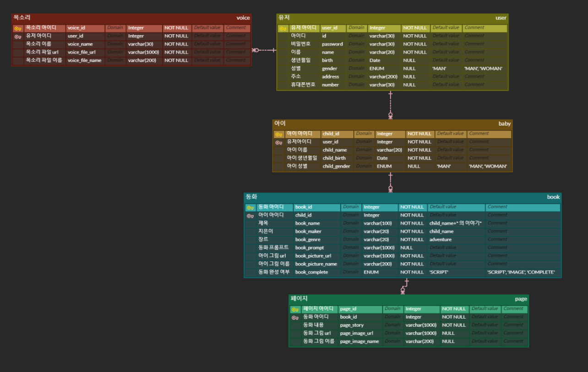

## 2024-04-18 목요일

- 기능 명세서를 바탕으로 ERD 작성

- PPT 발표 자료 배경 조사 및 기술 소개 부분 작성  

## 2024-04-19 금요일 

- 주요 기술 및 기대효과 페이지 PPT 작성 
ex) 예시사진

- 필드트립에서 ai 관련 체험을 통해 지식 습득

## 2024-04-22 월요일

- api 명세서 작성
ex) 예시사진

## 2024-04-23 화요일

- api 명세서 마무리(공통)
    1) 스토리 관련 api 명세서 작성 및 수정

- gerrit 초기 설정
    1) gerrit admin 계정 비밀번호 설정
    2) EC2의 gerrit repository 생성 및 gitlab과 연동
    3) 로컬 개발 환경 설정 맞추기
    4) notion에 gerrit 관련 자료 정리 