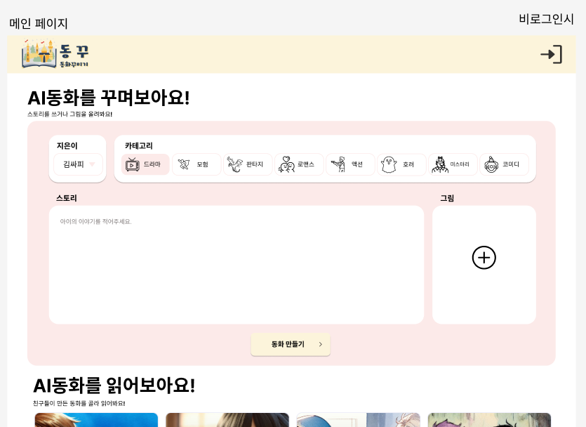
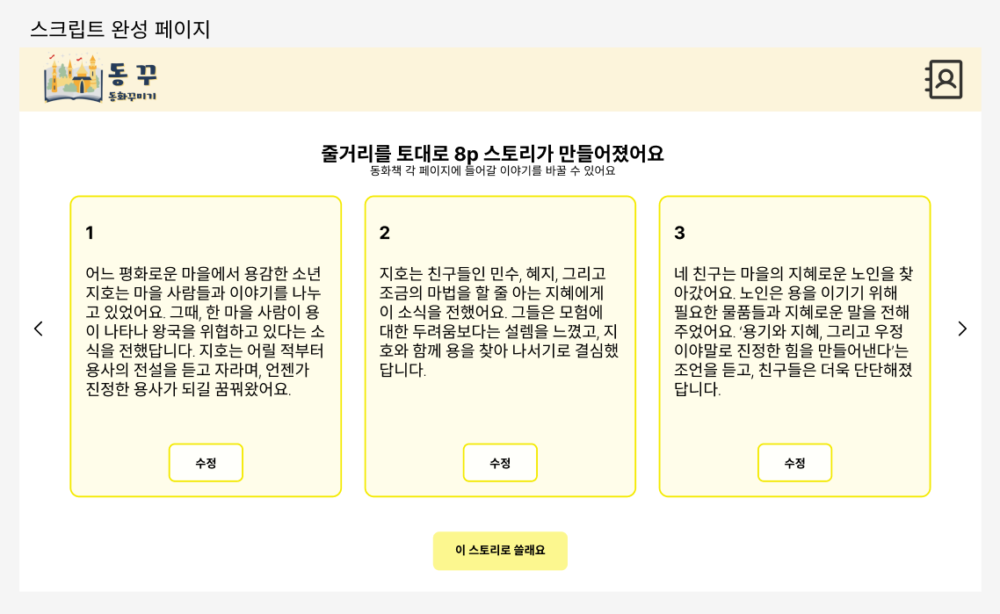
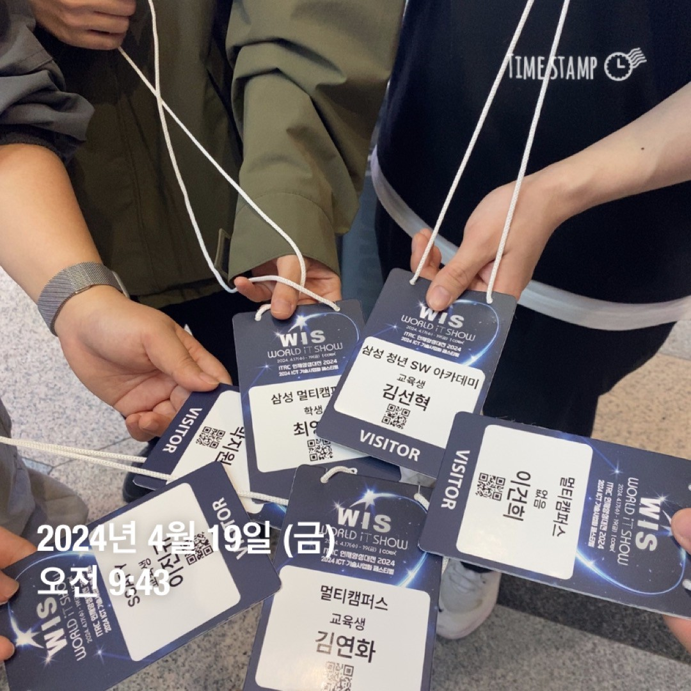
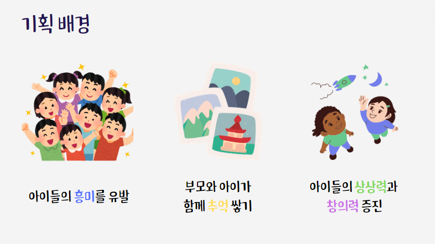

# 박지원 일일 작업 내용 정산

## 2주차

### 04-18

1. 컴포넌트 UI 목업 디자인

- 메인페이지

- 스크립트페이지

- 동화보기페이지

### 04-19

1. 필드 트립 참여

2. 중간발표 ppt제작

### 04-22

1. 페이지 목업 작업

- 메인페이지 알림

- 랜딩페이지 작업중

### 04-23

1. 페이지 작업

- 랜딩 페이지 작업

### 04-24

1. frontend 초기셋팅

- tailwindCSS 세팅

- DaisyUI 세팅

2. Figma 수정

- 동화 보기 페이지 figma 수정

3. Next.js 학습중

- twiter 클론코딩 중

