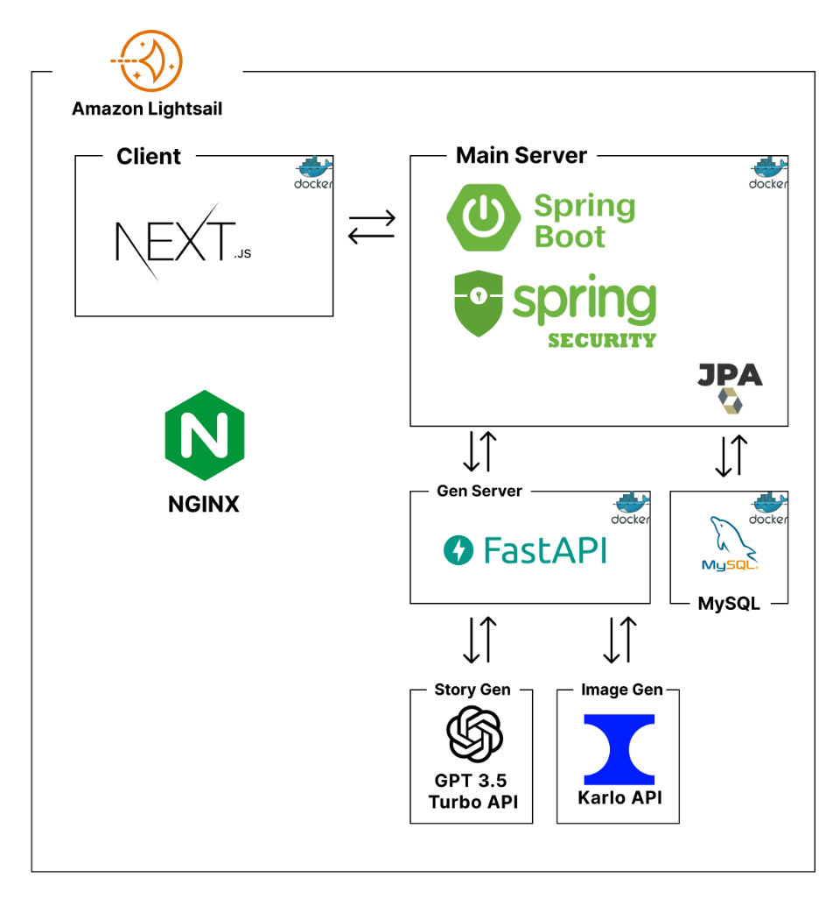
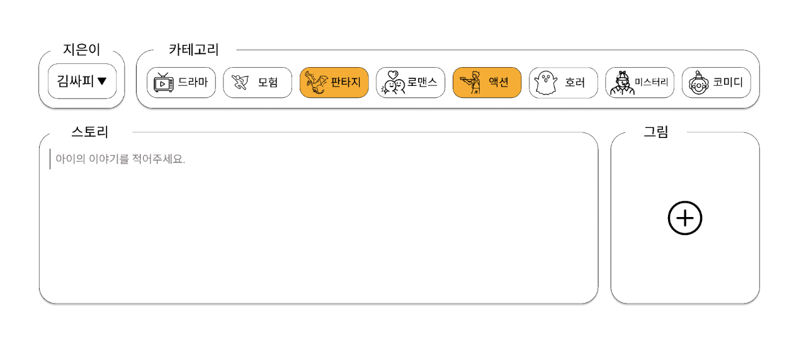
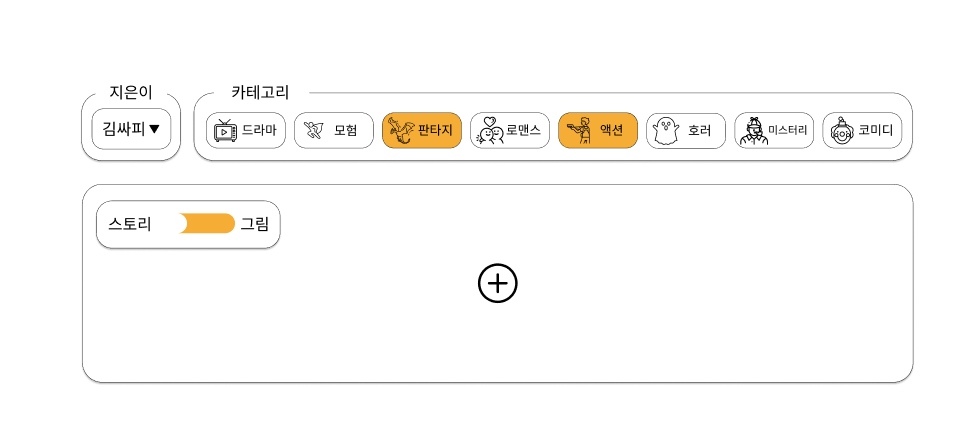

# 이건희 일일 작업 내용 정산

## 2주차

### 04-26

1. Nextjs SSR 배포 완료
2. SpringBoot 서버 배포 완료
3. MySQL DB 배포 완료
4. nginx, env 설정 완료
5. Nextjs 디렉토리 설정 완료

### 04-25

1. jenkins 배포 스크립트 작성 및 테스트 완료
2. nginx 설정 완료
3. 도메인 적용 및 SSL 적용 완료
4. Nextjs 클라이언트 배포 완료
5. 현재 도메인 주소로 접속시 Nextjs 서버가 404 에러 발생하는 문제 해결 중

### 04-23

1. LightSail 설정

   - 패키지 설정
   - 스왑 메모리 설정
   - jenkins 세팅
   - nginx 세팅

2. EC2 G4 인스턴스 세팅

3. 서버 구성 초안
   

4. Api 문서 초안 작업

### 04-22

1. Api 문서 작업

   - api 응답값 작성

2. AWS EC2 추가 서버 설정
   - EC2 G4 추가 인스턴스 생성 및 설정
3. 교보제 신청서 작성

### 04-19

1. 코엑스 IT WORLD 필드 트립
   코엑스 IT WORLD 필드 트립에 참여 했습니다. 다양한 기업의 부스에 참여 하였고, 그 중 삼성전자 Ai 부스 와 카카오 Ai 부스에 집중적으로 참여 했습니다. 삼성전자 Ai 부스에서는 온디바이스 Ai가 어떻게 실제로 적용되고 있는지 실제로 체험하며 단순히 웹 분야 뿐만 아니라 다양한 분야에서도 활용 가능성을 배울 수 있었습니다.
   카카오 Ai 부스에서는 이번 A402팀의 프로젝트와 직접적으로 연관되어 있는 생성형 Ai 모델 들을 직접 사용해 보며, 현재 카카오의 Ai 기술력을 확인 할 수 있었습니다. 클라우드 기반으로 이미지를 생성하는 모델과 Diffusion 모델을 기반으로 카카오가 새롭게 만들어낸 이미지 생성 모델 등을 직접 체험하며 이번 프로젝트에 대해서 새로운 인사이트를 얻을 수 있었습니다.

2. 중간 발표 PPT 제작
   필트 트립 이후에 이어서 팀원들과 중간 발표 PPT를 제작했습니다.

### 04-18

1. 컴포넌트 UI 목업제작
   
   

2. 발표 PPT 초안 제작
