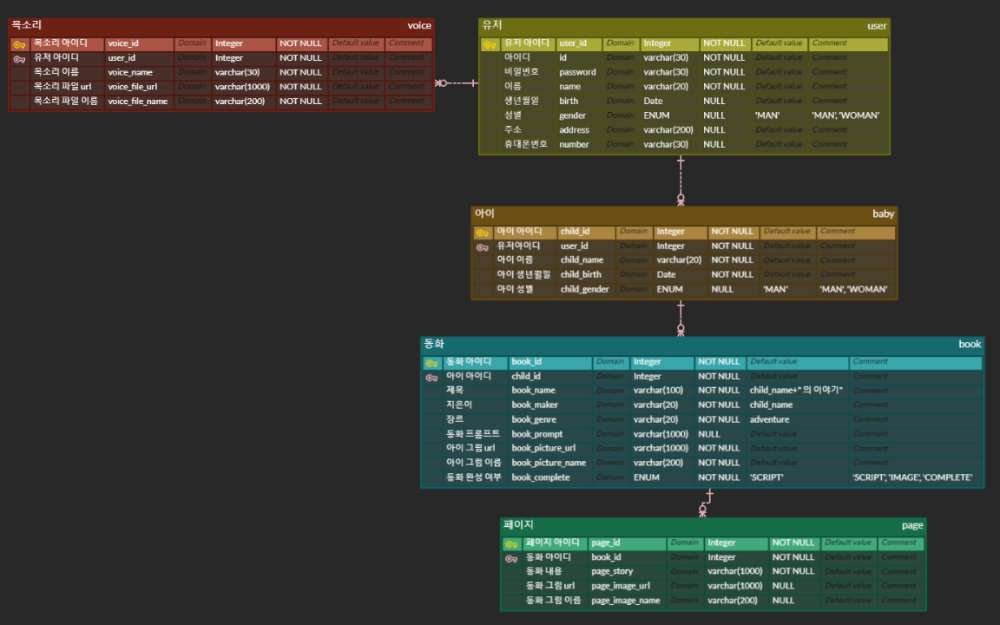
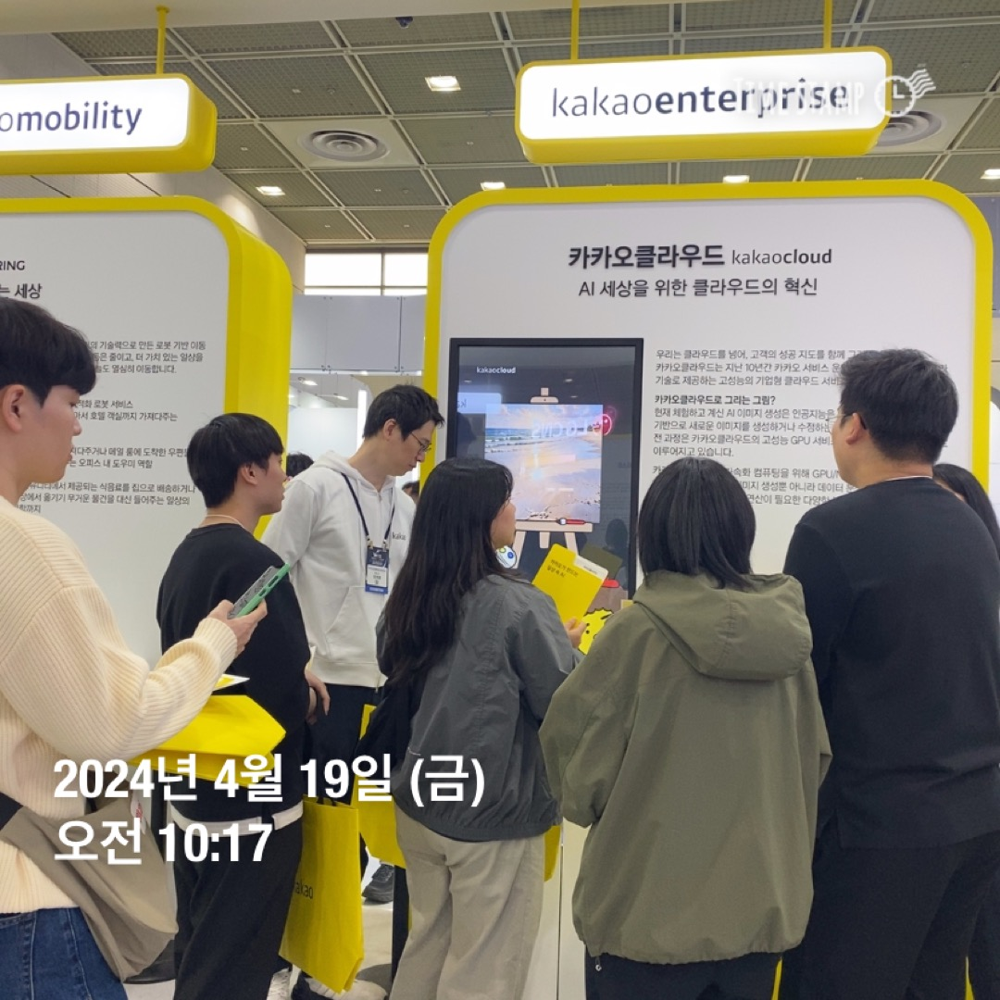
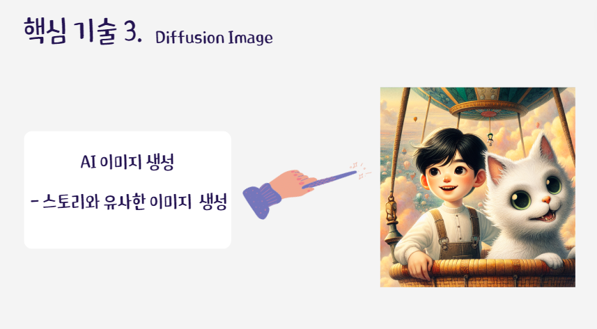

## 4/18 - 동화 꾸미기 프로젝트 ERD 작성

- 기능 명세서를 보고 프로젝트에 대한 ERD 작성

---

## 4/19 - 필드 트립 참여 및 PPT 제작

- 코엑스 필드 트립 참여 및 PPT 제작

코엑스 필드 트립에 참여하여 이번 프로젝트의 핵심 기술 중 하나인 생성형 AI에 대한 인사이트를 얻었습니다. 실제로 많은 기업들에서 생성형 AI를 이용한 결과물 들을 홍보하고 있었고, 현 시대에 핫한 기술 중 하나라는 것을 확인하였습니다. 카카오 부스에서는 칼로 서비스를 개발한 개발자 분의 도움을 통해서 직접 서비스를 이용해보았고 이번 프로젝트에서 어떤식으로 구현하면 좋을지에 대해 다시 한번 생각해 보았습니다. 이 외에도 많은 부스를 직접 체험하면서 현재 떠오르는 기술들을 확인하고 경험해봄으로써 저한테 많은 도움이 되는 활동이었습니다.

- 이후 캠퍼스에 복귀하여 다음주 기획 발표 PPT를 팀원들과 작성하였습니다.

## 4/22 - 발표 경청 및 API 완성

- 다른 팀들의 기획 발표를 들으면서 다양한 아이디어들이 나오는 부분과 기술력에 놀랐고, 저희 프로젝트를 진행하면서 볼륨이나 집중해서 구현할 부분에 대해 재고해보는 계기가 되었습니다. 오후 시간에는 팀원들과 API를 작성해서 기능들을 정리함으로써 프로젝트 구현 내용을 정리하였습니다.

## 4/23 - 서버 아키텍쳐 설계 및 AI 보이스 기술 탐색

- 백엔드 팀원과 서버 아키텍쳐를 설계하고 오후 시간에는 저희 프로젝트인 부모님의 목소리를 동화를 읽어주는 기능을 구현하기 위해서 AI 보이스 기술들을 탐색하고 어떤식으로 구현해야 할지에 대해 공부하였습니다.